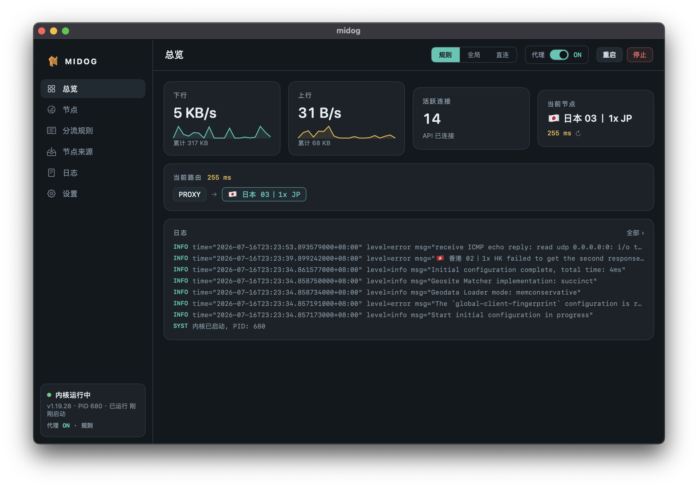

<div align="center">

# midog

### 可能是最轻的 Mac 戒色神器

**把不健康的网站挡在外面，把清爽的网络留给自己。**

macOS 原生网站拦截与 Clash 代理工具<br>
SwiftUI + AppKit · 内置 mihomo 内核 · UI 内存约 30 MB

内置成人内容名单，系统级过滤与代理 / TUN 规则双层拦截。

</div>

---

## ⚡ 也是一个轻巧的原生 Clash 代理工具

**UI 内存占用仅约 30 MB，让代理管理轻装上阵。**

SwiftUI + AppKit 原生界面，搭配内置 mihomo 内核。节点、订阅、规则和日志都能直接管理，日常操作不必来回修改配置文件。

| midog 原生 UI | 其他客户端参考占用 |
| --- | --- |
| **约 30 MB** | **200 MB+** |

> 内存数字由项目作者提供。30 MB 仅指 UI 进程，不含独立代理内核及系统扩展；其他客户端的版本、场景与统计口径尚未列出，以上不是同条件基准测试。实际占用随使用情况变化。



### 轻巧，也把常用功能备齐

| 功能 | 你可以做什么 |
| --- | --- |
| 节点管理 | 按分组浏览节点、批量测速、一键切换 |
| 多订阅管理 | 添加多个节点来源，导入 Clash YAML；按来源更新订阅 |
| 灵活分流 | 切换规则 / 全局 / 直连模式，编辑规则，导入远程或本地规则集 |
| 流量与日志 | 查看实时上下行、活跃连接、当前链路和内核日志 |
| 配置热更新 | 保存端口、DNS、hosts 等配置后热重载，减少连接中断 |
| 菜单栏常驻 | 关窗后继续运行，需要时随时唤起 |

## 快速上手

**先开启网站防护**

1. 将正确签名的 `midog.app` 安装到「应用程序」。
2. 打开 App，按系统提示批准系统扩展和内容过滤。
3. 需要代理 / TUN 流量过滤时，再完成下面的代理配置。

**再配置 Clash 代理**

1. 进入「节点来源」，粘贴 Clash 订阅链接或导入本地 YAML。
2. 回到「总览」，启动内核并打开代理开关。
3. 在「节点」页测速，选择要使用的节点。

> 首次启动内核会请求管理员授权，以安装 launchd 系统服务。TUN 未生效时，可在总览页重启内核并检查日志。

## 安装与系统要求

- macOS 15（Sequoia）或更高版本。
- 支持 Apple Silicon 与 Intel。
- 暂未提供编译好的发布包，请参照下方说明从源码构建。

<details>
<summary>系统过滤的构建说明</summary>

正式发布时需给 App 和 `midogFilter` target 配置同一个 Apple Developer Team、签名，并把签名后的 App 安装到 `/Applications`。首次启动要在系统设置中批准系统扩展和内容过滤。Debug 使用开发签名权限，Release 使用 Developer ID 系统扩展权限；发布包还需公证。未签名构建只能用于编译检查，不能安装系统扩展。扩展目前使用随 App 发布的规则快照，更新列表需发布新版 App。过滤器无法从每条网络连接取得域名，代理流量仍由 midog-core 规则兜底。

仅在已关闭 SIP 的本机开发环境，可运行 `scripts/build-local-filter.sh` 生成临时签名的测试 App；这只验证构建和签名，不保证 NetworkExtension 接受未获授权的权限，也不能用于发布。开启系统扩展开发模式可跳过 App 必须位于「应用程序」目录的检查：`systemextensionsctl developer on`。测试结束后应恢复 SIP。


</details>

<details>
<summary>从源码构建</summary>

克隆本仓库后，打开 Xcode 工程：

```bash
open midog.xcodeproj
```

在 Xcode 中选择 `midog` scheme，`⌘R` 运行即可。内核已以 gzip 形式内置在 `midog/Resources/midog-core.gz`，无需额外准备。


</details>

## 技术架构

```
midog/
├── Core/                  # 无 UI 的核心逻辑
│   ├── CoreService.swift        # launchd 内核服务
│   ├── KernelInstaller.swift    # 内置内核释放
│   ├── ControllerClient.swift   # mihomo RESTful API 客户端（节点/测速/连接）
│   ├── ConfigGenerator.swift    # 生成内核运行配置
│   ├── SubscriptionParser.swift # 订阅下载与 Clash YAML 校验
│   ├── RulesetParser.swift      # 远程规则集解析（base64 / gfwlist …）
│   └── Store.swift              # 应用状态中心
├── Views/                 # SwiftUI 界面
│   ├── DashboardView / NodesView / RulesView
│   ├── SourcesView / LogsView / SettingsView
│   └── Components / Theme       # 自绘组件与主题
└── Resources/midog-core.gz    # 内置 mihomo 内核
```

设计要点：

- **内核由 launchd 管理**：服务使用 `-d` 指向应用数据目录，异常退出自动重启；midog 通过 REST API 通信，退出 App 不结束内核
- **热更新优先**：订阅刷新走 provider 级更新、内核配置改动走热重载，尽量不打断已有连接
- **状态持久化**：节点选择、fake-ip 缓存等由内核 profile 持久化，重启后保持上次状态

## 常见问题

**订阅提示"需要 Clash 格式 YAML"？**
midog 使用 Clash 配置格式，暂不支持 V2Ray 通用节点链接（`vmess://` 等）订阅。请在机场后台选择 Clash / Clash Meta 订阅链接。

**开启 TUN 后没有生效？**
首次启动时授权安装 launchd 服务；如果 TUN 未生效，在总览页重启内核并检查系统日志。

**数据存储在哪里？**
配置、规则（`rules.txt`）、订阅缓存与释放后的内核统一存放在应用数据目录，可在 **设置 → 数据目录** 中直接打开。

## 参与贡献

欢迎 Issue 和 Pull Request！

1. Fork 本仓库并创建特性分支
2. 保持零第三方依赖的原则，代码风格与现有代码一致
3. 提交 PR 并描述改动动机

## 致谢

- [mihomo (Clash Meta)](https://github.com/MetaCubeX/mihomo) — 强大的代理内核
- 所有维护公开分流规则集的社区贡献者

## 许可证

本项目基于 [MIT License](LICENSE) 开源。

内置的 mihomo 内核遵循其自身的 [GPL-3.0 协议](https://github.com/MetaCubeX/mihomo/blob/Meta/LICENSE)。

---

<div align="center">

**midog** — 拦住不想看的网站，连上想去的世界。

如果这个项目对你有帮助，欢迎点一个 ⭐️

</div>
